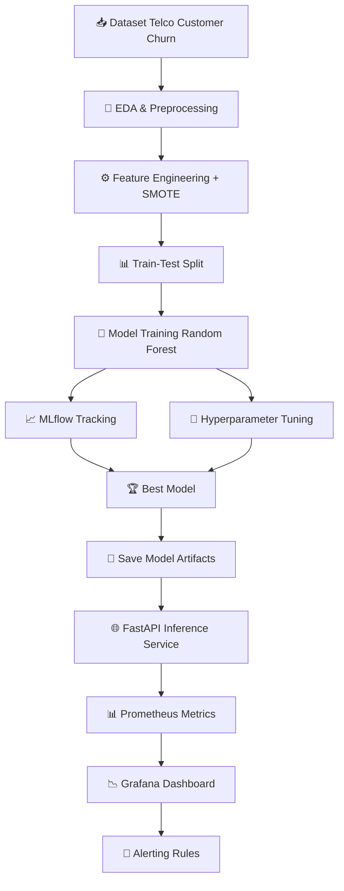
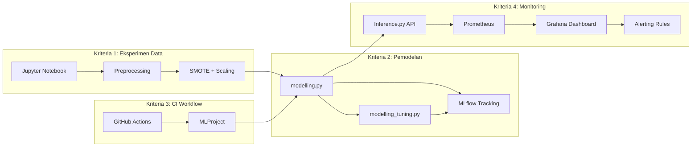
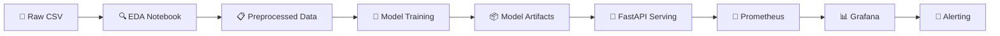

# 📦 SMSML_Rois-Hoiron – Submission Package for Dicoding SMSML Project

## 🎯 Purpose
This directory is the **final ZIP package** (without nested ZIP) that will be submitted for the **SMSML – Membangun Sistem Machine Learning** challenge. It contains all required artefacts for the four evaluation criteria:

| Criterion | Folder / File | Description |
|-----------|----------------|-------------|
| **1 – Eksperimen Data** | `Eksperimen_SML_Rois-Hoiron.txt` | Screenshot / text proof of the exploratory notebook, dataset preprocessing, and DVC versioning. |
| **2 – Model & MLflow** | `Membangun_model/` | `modelling.py`, `modelling_tuning.py`, trained model artefacts (`churn_model.pkl`, `scaler.pkl`, `feature_names.pkl`), preprocessing data, MLflow screenshots, DagsHub link, and requirements. |
| **3 – CI Workflow** | `Workflow-CI.txt` & `.github/` inside the repo | GitHub Actions workflow that runs `mlflow run MLProject` (lint, testing, artefact generation) and proof of CI execution. |
| **4 – Monitoring & Logging** | `Monitoring dan Logging/` | FastAPI serving (`Inference.py`), Prometheus configuration (`prometheus.yml`), exporter (`prometheus_exporter.py`), monitoring screenshots, Grafana dashboard (named after your Dicoding username) and alerting rules. |

## 📊 Visualisasi Diagram

### Flowchart — Alur Kerja End-to-End



### Diagram Arsitektur Sistem



### Pipeline Diagram — Data hingga Deploy



## 📂 Directory Structure (as it will appear in the ZIP)
```
SMSML_Rois-Hoiron.zip
├── Eksperimen_SML_Rois-Hoiron.txt
├── Membangun_model/
│   ├── modelling.py
│   ├── modelling_tuning.py
│   ├── models/
│   │   ├── churn_model.pkl
│   │   ├── scaler.pkl
│   │   └── feature_names.pkl
│   ├── namadataset_preprocessing/
│   │   ├── X_train.csv
│   │   ├── X_test.csv
│   │   ├── y_train.csv
│   │   └── y_test.csv
│   ├── Dagshub.txt
│   ├── screenshoot_artifak.jpg
│   └── screenshoot_dashboard.png
├── Monitoring dan Logging/
│   ├── Inference.py
│   ├── prometheus.yml
│   ├── prometheus_exporter.py
│   ├── bukti_serving/
│   ├── monitoring_prometheus/
│   ├── monitoring_grafana/
│   └── alerting_grafana/
├── Workflow-CI.txt
├── requirements.txt          # Unified dependencies for CI, model training, and monitoring
└── README.md   ← **this file**
```

## 🚀 How to Use / Verify

> **MLflow Authentication** – sebelum menjalankan `python modelling.py` set environment variables:
> ```bash
> export MLFLOW_TRACKING_USERNAME=roiskhoiron
> export MLFLOW_TRACKING_PASSWORD=<your_dagshub_token>
> ```
> Token dapat dibuat di DagsHub → Settings → Tokens.
> 
> Perintah berikut akan otomatis memakai token tersebut.

1. **Run the EDA Notebook** (Kriteria 1)
   ```bash
   cd "../Customer-Churn-EDA/preprocessing"
   jupyter notebook Eksperimen_Rois-Hoiron.ipynb
   ```
   Run all cells (Data Loading → EDA → Preprocessing → SMOTE → Feature Engineering). Output files (`X_train.csv`, `X_test.csv`, etc.) are saved to `namadataset_preprocessing/` and versioned via DVC.

2. **Train the Model** (Kriteria 2)
   ```bash
   cd "../SMSML_Rois-Hoiron/Membangun_model"
   pip install -r requirements.txt
   python modelling.py        # base training + MLflow
   python modelling_tuning.py # hyperparameter tuning (optional, for Advanced)
   ```

3. **Run the Prometheus Exporter** (system metrics)
   ```bash
   cd "../SMSML_Rois-Hoiron/Monitoring dan Logging"
   python prometheus_exporter.py
   ```
   Exports `system_cpu_percent` & `system_memory_percent` at `http://localhost:8001/metrics`.

4. **Run the API for Serving** (Kriteria 4)
   ```bash
   cd "../SMSML_Rois-Hoiron/Monitoring dan Logging"
   uvicorn Inference:app --host 0.0.0.0 --port 8000
   ```
   Exposes `/predict`, `/health`, and Prometheus metrics at `http://localhost:8000/metrics`.

5. **Start Prometheus** (scrape metrics from both exporters)
   ```bash
   cd "../SMSML_Rois-Hoiron/Monitoring dan Logging"
   prometheus --config.file=prometheus.yml
   ```
   Prometheus UI available at `http://localhost:9090`.

6. **Install & Run Grafana** (lakukan salah satu sesuai OS):

    # ==============================================================================
    # UBUNTU / DEBIAN (LINUX APT)
    # ==============================================================================

    # 1. Pasang dependensi awal
    sudo apt-get install -y apt-transport-https software-properties-common wget gnupg

    # 2. Unduh dan tambahkan GPG key resmi
    wget -q -O - https://grafana.com | gpg --dearmor | sudo tee /usr/share/keyrings/grafana.gpg > /dev/null

    # 3. Tambahkan repositori stabil Grafana
    echo "deb [signed-by=/usr/share/keyrings/grafana.gpg] https://grafana.com stable main" | sudo tee -a /etc/apt/sources.list.d/grafana.list

    # 4. Perbarui daftar paket dan instal Grafana
    sudo apt-get update
    sudo apt-get install grafana-enterprise

    # 5. Aktifkan dan jalankan layanan Grafana
    sudo systemctl daemon-reload
    sudo systemctl enable grafana-server
    sudo systemctl start grafana-server


    # ==============================================================================
    # WINDOWS (COMMAND PROMPT / CMD - RUN AS ADMINISTRATOR)
    # ==============================================================================

    # Jalankan layanan setelah selesai menginstal file MSI
    net start grafana


    # ==============================================================================
    # MACOS (HOMEBREW)
    # ==============================================================================

    # 1. Perbarui Homebrew dan pasang Grafana
    brew update
    brew install grafana

    # 2. Jalankan layanan Grafana
    brew services start grafana


    # ==============================================================================
    # DOCKER (LINTAS PLATFORM)
    # ==============================================================================

    # Jalankan container Grafana Enterprise di port 3000
    docker run -d --name=grafana -p 3000:3000 grafana/grafana-enterprise
```
___
```bash
    # Lets Check the Endpoint of your inference
    # open grafana on browser
    http://localhost:3000/ with admin/admin

    # Health check
    curl http://localhost:8000/health

    # Prometheus metrics
    curl http://localhost:8000/metrics

    # Prediction (replace values with actual feature data)
    curl -X POST http://localhost:8000/predict \
        -H "Content-Type: application/json" \
        -d '{
            "data": {
                "gender": "Female",
                "SeniorCitizen": 0,
                "Partner": "Yes",
                "Dependents": "No",
                "tenure": 12,
                "PhoneService": "Yes",
                "PaperlessBilling": "Yes",
                "MonthlyCharges": 70.35,
                "TotalCharges": 845.5,
                "MultipleLines_No phone service": 0,
                "MultipleLines_Yes": 1,
                "InternetService_Fiber optic": 1,
                "InternetService_No": 0,
                "OnlineSecurity_No internet service": 0,
                "OnlineSecurity_Yes": 0,
                "OnlineBackup_No internet service": 0,
                "OnlineBackup_Yes": 1,
                "DeviceProtection_No internet service": 0,
                "DeviceProtection_Yes": 0,
                "TechSupport_No internet service": 0,
                "TechSupport_Yes": 0,
                "StreamingTV_No internet service": 0,
                "StreamingTV_Yes": 1,
                "StreamingMovies_No internet service": 0,
                "StreamingMovies_Yes": 0,
                "Contract_One year": 0,
                "Contract_Two year": 0,
                "PaymentMethod_Credit card (automatic)": 0,
                "PaymentMethod_Electronic check": 1,
                "PaymentMethod_Mailed check": 0,
                "ChargesPerMonth": 70.35,
                "TenureBin": 0,
                "SeniorPartner": 0
            }
            }'
    ```
```

5. **Run CI locally** (optional) with:
   ```bash
   cd "../Customer-Churn-MLOps"
   mlflow run MLProject --env-manager=local
   ```

6. **Confirm all proof files** (`*.txt`, `*.jpg`, `*.png`) are present.


## 📦 Data Versioning with DVC

The preprocessing data (`namadataset_preprocessing/`) is tracked using **DVC** with **DagsHub** as remote storage. This ensures:

- EDA CI (`Customer-Churn-EDA`) pushes preprocessed data to DagsHub after each run.
- MLOps CI (`Customer-Churn-MLOps`) pulls the latest data before model training.
- No large files are stored in Git; only DVC metadata (.dvc files) are versioned.

To reproduce locally:
```bash
# In either repo
dvc pull   # downloads latest preprocessing data from DagsHub
```

## 📝 Submission Checklist (Anti‑Rejection)
- [ ] Folder hierarchy matches the template above.
- [ ] All four criteria artefacts are present.
- [ ] No nested ZIP files.
- [ ] All GitHub repositories referenced are **public**.
- [ ] Grafana dashboard name equals your Dicoding username.
- [ ] No plagiarism – all code is original.

---
**Dicoding SMSML 2026 – Student:** Roishoiron
